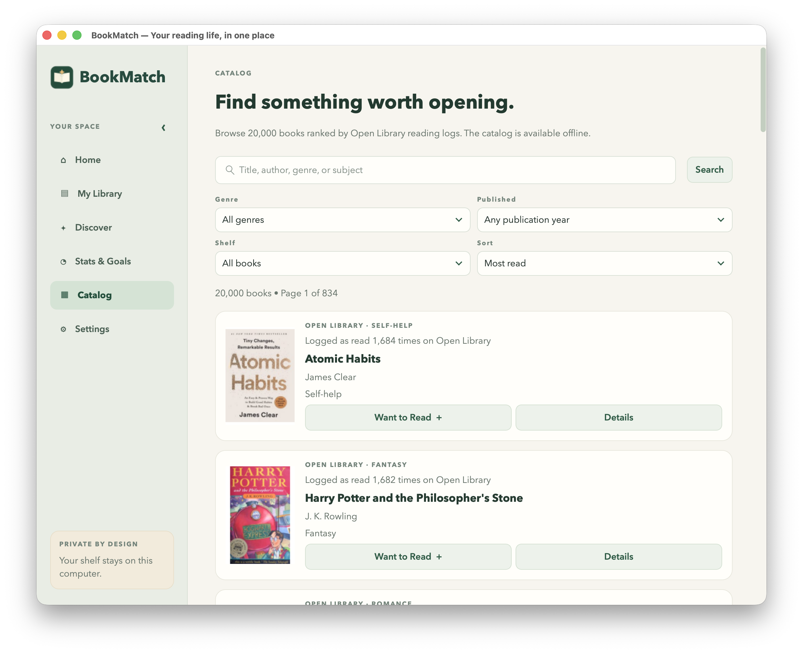
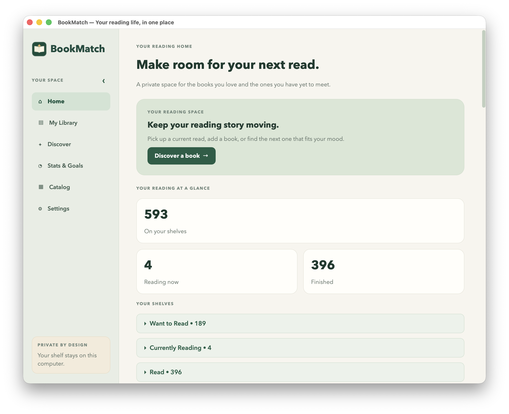
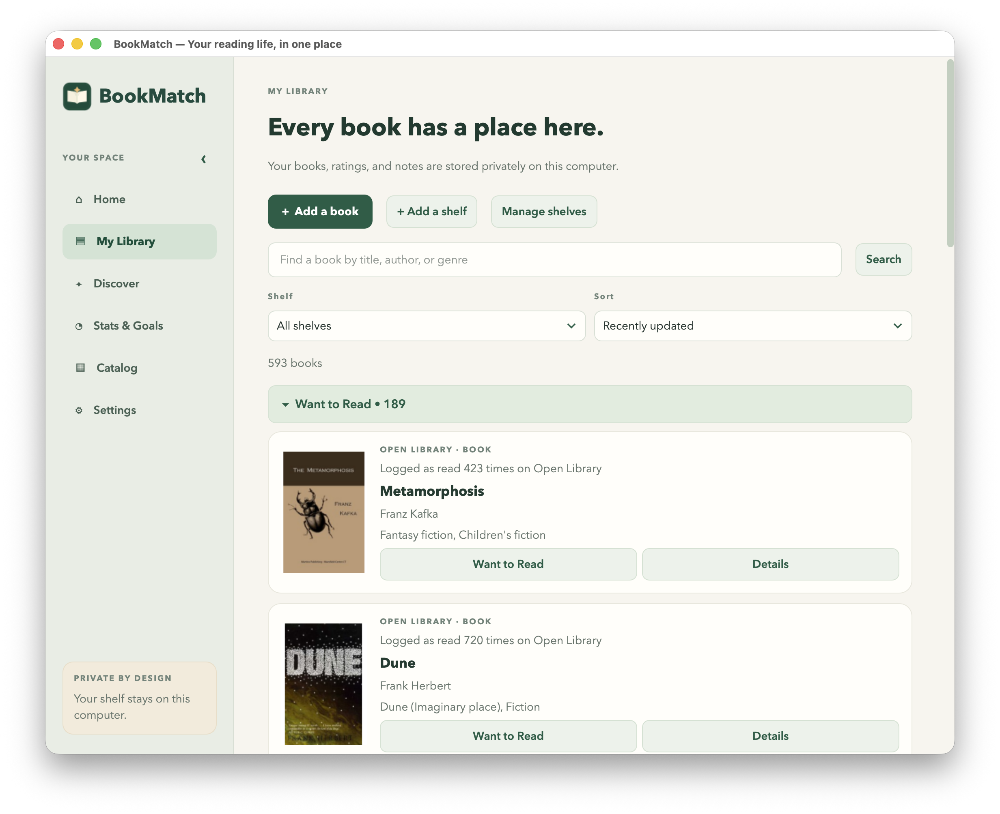
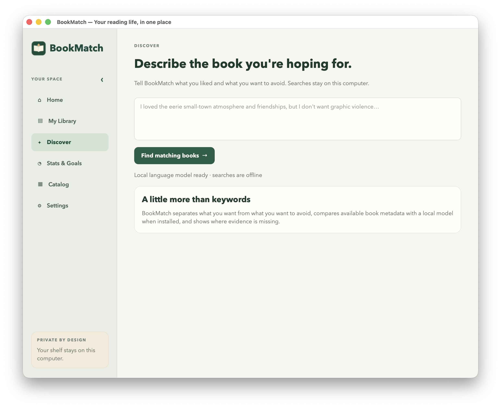
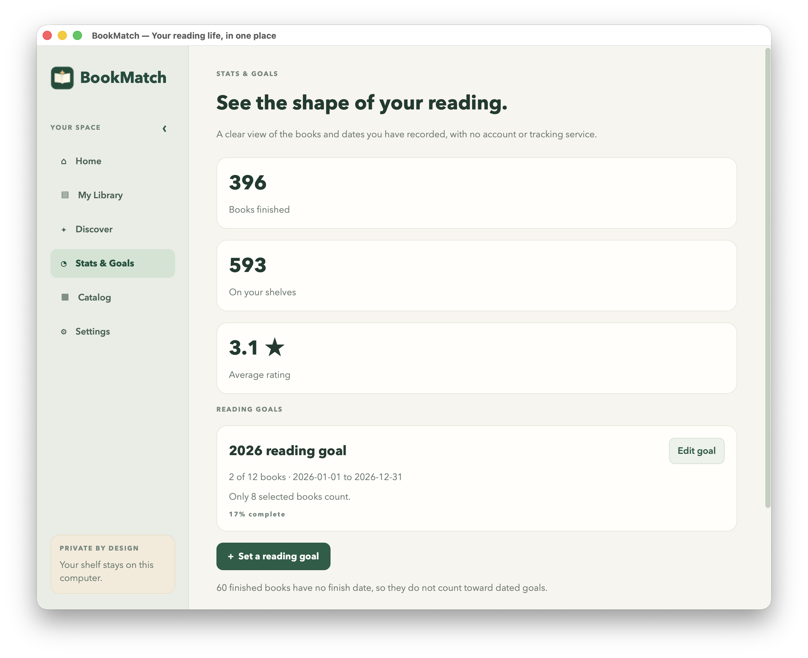
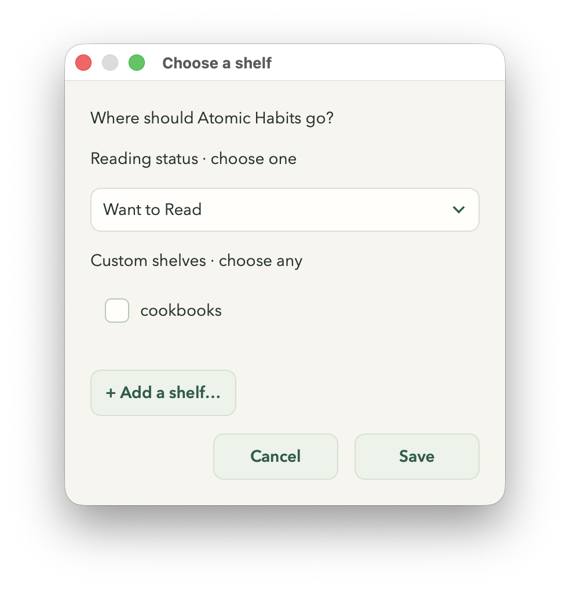
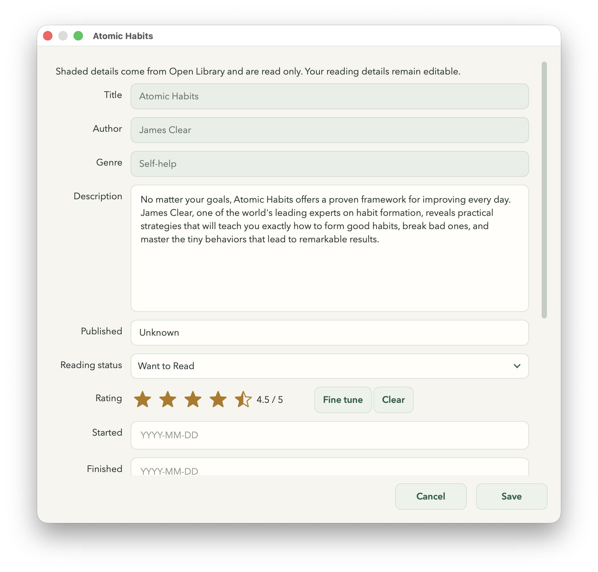
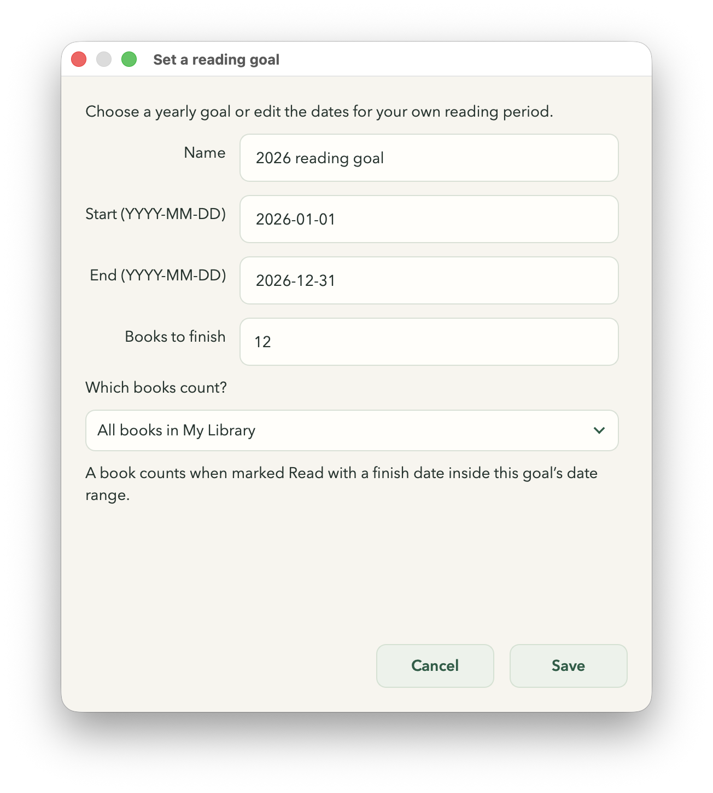
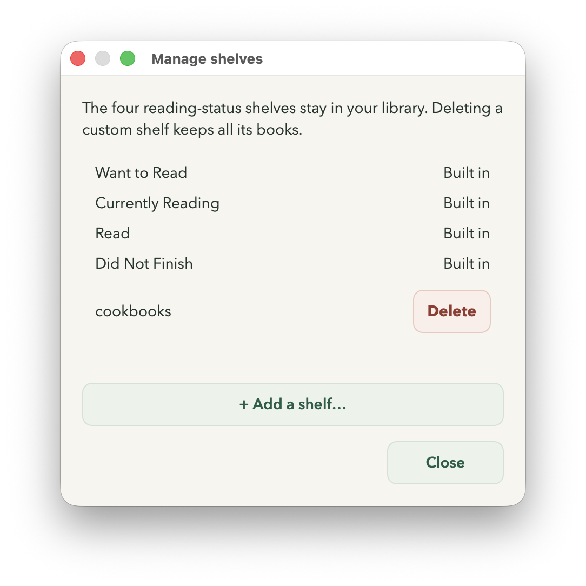

# BookMatch

A private desktop reading companion built with Python, PySide6, SQLite, and local semantic search. Organize your reading, set goals, and discover your next book from a catalog of 20,000 Open Library works. No account, subscription, paid API, or cloud database is required.

**Current version: 0.2.22 · Apple Silicon Mac build verified · Windows packaging prepared, unverified**



## Features

- **Your reading library:** four reading statuses, multiple custom shelves, collapsible shelf sections, quarter-star ratings, dates, reviews, and private notes.
- **Personal reading goals:** editable dates and targets; count all books or specific books, with a shortcut to select a shelf’s current contents. Delete goals without deleting books.
- **Discovery:** describe what you want and what you want to avoid. A free optional local embedding model compares available metadata; a clearly labeled metadata fallback works without it. Filter by genre and publication year, and sort by popularity or match quality.
- **Offline catalog:** 20,000 public works, local search and filters, clickable pagination, and ten rotating Home picks from the top 75 eligible popular books.
- **Thoughtful desktop UI:** responsive cards and forms, a collapsible sidebar, rounded animated option pickers, visible star fills, and consistent text-only notices.
- **Portable data:** preview Goodreads CSV or BookMatch JSON imports, export private backups, and clear saved books with confirmation.

The popularity ranking counts `Already Read` entries in Open Library’s August 2026 reading logs. It represents activity on Open Library, rather than worldwide sales or readership. The repository contains aggregate counts and public metadata; it contains no reading-log user records. See [catalog provenance](data/SOURCE.md).

[Usage guide](docs/USAGE.md) · [Architecture](docs/ARCHITECTURE.md) · [Review and release status](PROJECT_STATUS.md) · [Third-party notices](THIRD_PARTY_NOTICES.md)

## Run from source

Use Python 3.11–3.14. The reviewed Mac build uses Python 3.14.7 on Apple Silicon.

```sh
python3 -m venv .venv
.venv/bin/python -m pip install -r requirements.txt
.venv/bin/python -m bookmatch_app
```

For Windows source runs, use `.venv\Scripts\python.exe` instead. Windows has not yet been validated.

## Build the Mac app

```sh
.venv/bin/python -m pip install -r requirements-build.txt
sh scripts/build_mac.sh
```

The script creates `dist/BookMatch.app` and `dist/BookMatch-mac-arm64.zip`. No separate Python installation is needed to run the packaged app. The build uses an ad hoc signature and has no Apple notarization; first launch may need a macOS security exception. It is a tested local Mac build, not a signed public installer.

For the exact reviewed dependency versions on Python 3.14 / macOS arm64, use `requirements-lock-macos-arm64.txt` instead of `requirements-build.txt`. The lock is specific to that build environment; it is not a Windows lock file.

On Windows x64, `scripts\build_windows.ps1` prepares dependencies, packages the executable, performs a launch check, and creates a ZIP. It remains a packaging preview until tested on Windows.

## Privacy and network access

Your library stays in `library.sqlite3` in the operating system’s BookMatch application data folder. Settings shows its location. It is a local, unencrypted database; operating system protections control access. `BOOKMATCH_DATA_DIR` can point development runs to an isolated folder.

| Action | Network use |
| --- | --- |
| Library, goals, catalog search, metadata fallback | None |
| Install optional recommendation model | Downloads the free model once; first catalog indexing takes time |
| Semantic search after installation | Local model and local index; search text is not uploaded |
| Display an uncached cover | Sends a public cover ID to Open Library and caches the image locally |
| Look up a missing description | Sends one public work ID to Open Library; responses are cached locally |

Goodreads exports, notes, reviews, ratings, and typed searches are never sent to Open Library or a hosted AI service. Covers and descriptions can be missing; generated covers and editable blank fields handle those cases. Subject tags and recommendation conflicts are incomplete community metadata, not verified content warnings.

Git excludes databases, exports, bulk source dumps, cover/model caches, virtual environments, and build outputs. The screenshots below were supplied and approved for publication by the project owner. No personal Goodreads export or old prototype is required to run or build BookMatch.

Starting with 0.2.5, upgrading removes legacy page-count, reading-progress, and ISBN columns. External backup files are not modified. **Clear saved books** removes library memberships and reading activity while retaining shelf definitions, goals, book metadata, and downloads; see the [usage guide](docs/USAGE.md).

## Development and review

```sh
QT_QPA_PLATFORM=offscreen BOOKMATCH_DISABLE_COVER_DOWNLOADS=1 \
  .venv/bin/python -m unittest discover -s tests -v
.venv/bin/python -m scripts.check_repository
```

The tests cover migrations, imports and backups, data clearing, goal selection and deletion, shelf behavior, local metadata lookup, discovery filtering, pagination, responsiveness, and popup styling. All tests use temporary data folders.

Check the packaged app with a separate test library:

```sh
QT_QPA_PLATFORM=offscreen BOOKMATCH_DATA_DIR=/tmp/bookmatch-package-check \
  dist/BookMatch.app/Contents/MacOS/BookMatch --self-test
```

Generate separate local demo screenshots using synthetic reading history and any public covers already cached on this computer, without downloads. They are saved in the ignored `.local/demo-screenshots/` folder and do not replace the owner's published screenshots:

```sh
QT_QPA_PLATFORM=offscreen .venv/bin/python -m scripts.capture_screenshots
```

[Source publishing procedure](docs/PUBLISHING.md) describes the staged-file audit and the contents intended for GitHub. No automated billing-dependent services are configured.

## Screenshots

















## License

The BookMatch application code has no open-source license assigned yet. Third-party software, the optional model, and public catalog data have their own terms, documented in [Third-party notices](THIRD_PARTY_NOTICES.md) and [catalog provenance](data/SOURCE.md). This does not assign a license to BookMatch itself.
